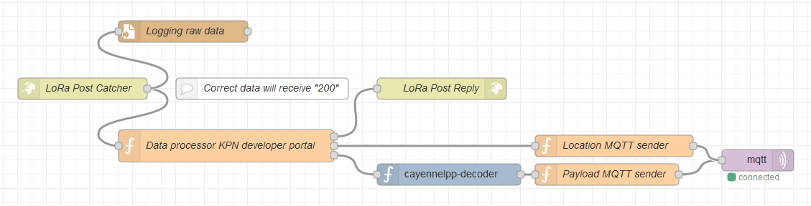

# KPN-Things-Portal-HTTPS-SenML-Plug-receiver
Node-Red flow for KPN developer Things Portal using HTTPS SenML Plug.

## Disclaimer
The PE1MEW KPN developer POST application is distributed in the hope that it will be useful, but WITHOUT ANY WARRANTY; without even the implied warranty of MERCHANTABILITY or FITNESS FOR A PARTICULAR PURPOSE.

## License
The PE1MEW KPN developer POST application is free software: You can redistribute it and/or modify it under the terms of a Creative Commons Attribution-NonCommercial 4.0 International License (http://creativecommons.org/licenses/by-nc/4.0/) by PE1MEW (http://pe1mew.nl) E-mail: pe1mew@pe1mew.nl.

 This work is licensed under a <a rel="license" href="http://creativecommons.org/licenses/by-nc/4.0/">Creative Commons Attribution-NonCommercial 4.0 International License</a>.

## Version history

version | Date      | Athour | Notes
--------|-----------|--------|-----------------------------------
1.0     | 12-1-2020 | PE1MEW | First release

## ToDo's

 1. Add authentication using shared secret

# Introduction
This flow is developed to receive HTTP Post data from KPN Things portal and publish data at a MQTT broker.
The received data is evaluated and when it meets the requirements for a valid payload-or postion-packet a "200" is send in responce.
The flow will decode a payload using CayenneLPP data format.

# Configuration

 1. Copy the code in to a new flow in Node-red using "ctrl-i".
 2. Configure the MQTT client for the right Broker.

## Prerequisites

 - The Node-red installation shall meet the requirements for the HTTP SenML Plug as stated in https://docs.kpnthings.com/dm/plugs/https#the-request.
 - This flow is using CayenneLPP formatted payload. Therefore "node-red-contrib-cayennelpp-extended" shall be installed in Node-red.
